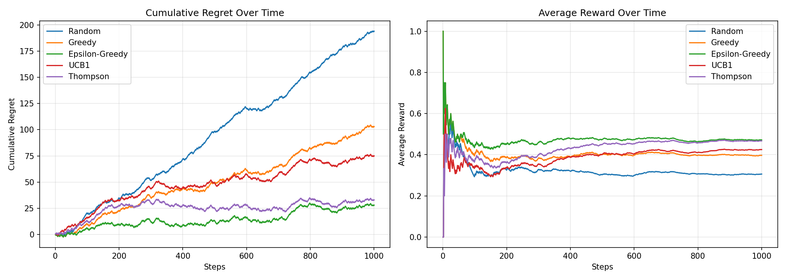
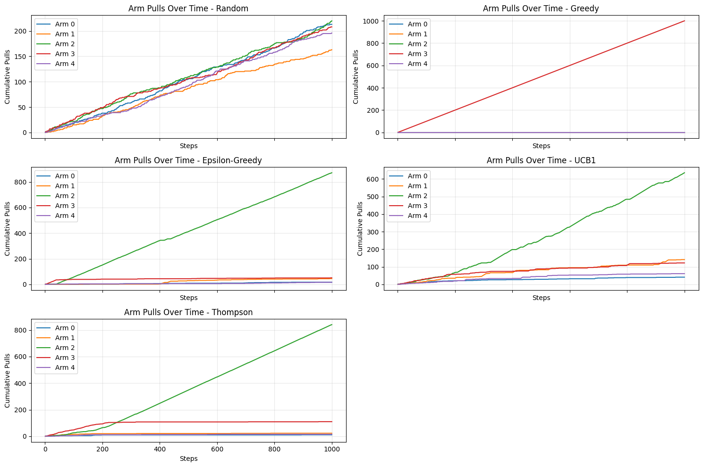

# `RovingBandit`


A flexible Python library for multi-armed bandit algorithms supporting regret minimization, best-arm identification, and variance minimization in both online and batched modes.

The name is a nod to [Mancur Olson](https://www.jstor.org/stable/2938736).

## Installation

```bash
# Development installation
uv venv
uv pip install -e ".[dev]"

# Production (when published)
uv pip install rovingbandit
```

## Quick Start

### New OOP API (Recommended)

```python
import numpy as np

from rovingbandit import (
    # environment
    BanditEnvironment,
    # objectives
    RegretMinimization,
    # runner
    OnlineRunner,
    # algorithms
    ThompsonSampling,
    EpsilonGreedy,
    UCB1,
    RandomPolicy,
)

import matplotlib.pyplot as plt

env = BanditEnvironment(
    n_arms=5,
    arm_means=np.array([0.1, 0.3, 0.5, 0.4, 0.2]), # arm 3 is the best arm
    seed=42,
)

policies = {
    "Random": RandomPolicy(n_arms=5, seed=42),
    "Greedy": EpsilonGreedy(n_arms=5, epsilon=0.0, seed=42),
    "Epsilon-Greedy": EpsilonGreedy(n_arms=5, epsilon=0.1, seed=42),
    "UCB1": UCB1(n_arms=5, seed=42),
    "Thompson": ThompsonSampling(n_arms=5, seed=42),
}

objective = RegretMinimization(optimal_reward=0.5)
runner = OnlineRunner()

fig, axes = plt.subplots(1, 2, figsize=(14, 5))

result = {}

# run each policy and plot
for name, policy in policies.items():
    env.reset_rng(42)
    result[name] = runner.run(policy, env, n_steps=1000, objective=objective)

    print(
        f"{name:15} | Final Regret: {result.final_regret:.2f} | Avg Reward: {result.average_reward:.3f}"
    )

    result[name].plot(metric="cumulative_regret", ax=axes[0], label=name)
    result[name].plot(metric="average_reward", ax=axes[1], label=name)

axes[0].legend()
axes[0].set_title("Cumulative Regret Over Time")
axes[1].legend()
axes[1].set_title("Average Reward Over Time")

# Random          | Final Regret: 194.00 | Avg Reward: 0.306
# Greedy          | Final Regret: 103.00 | Avg Reward: 0.397
# Epsilon-Greedy  | Final Regret: 28.00 | Avg Reward: 0.472
# UCB1            | Final Regret: 75.00 | Avg Reward: 0.425
# Thompson        | Final Regret: 33.00 | Avg Reward: 0.467

```



We can also visualize the sequence of arms pulled by each policy:

```python
f, ax = plt.subplots(3, 2, figsize=(15, 10), sharex=True, sharey=False)
# plot arm pulls for each policy
for i, (name, res) in enumerate(result.items()):
    res.plot(
        metric="arm_pulls",
        ax=ax[i // 2, i % 2],
    )
    ax[i // 2, i % 2].legend()
    ax[i // 2, i % 2].set_title(f"Arm Pulls Over Time - {name}")
f.delaxes(ax[2, 1]) # delete unused subplots
f.tight_layout()
```



## Implementation Status

### ✅ Phase 1: Core Infrastructure (COMPLETED)

**Modular OOP Architecture**
- Clean separation of `Policy`, `Objective`, `Environment`, and `Runner` classes
- Support for all three main objectives
- Both online (sequential) and batched (parallel) execution modes
- **28/28 tests passing**, ~60% coverage (new code >80%)

**Available Policies**
- `RandomPolicy` - Uniform random baseline
- `GreedyPolicy` - Pure exploitation
- `EpsilonGreedy` - ε-greedy with optional decay
- `ExploreFirst` - Explore-then-commit
- `UCB1` - Upper Confidence Bound (logarithmic regret)
- `ThompsonSampling` - Bayesian posterior sampling
- `TopTwoThompson` - Best-arm identification (Russo, 2016)
- `BudgetedUCB` - Cost-aware UCB for budget constraints
- `BudgetedThompsonSampling` - Cost-aware Thompson Sampling
- `EpsilonNeymanAllocation` - Explore uniformly then allocate by estimated standard deviation (requires horizon; best for K ≥ 3)

**Objectives**
- `RegretMinimization` - Minimize cumulative regret
- `BestArmIdentification` - Identify best arm with confidence
- `VarianceMinimization` - Minimize estimation variance

**Runners**
- `OnlineRunner` - Sequential decision-making with budget support
- `BatchedRunner` - Parallel batch processing

**Legacy Functions** (all working)
- `pick_arm()`, `sim_runner()`, `arm_sequence()`, `pull_sequence()`
- `best_arm()`, `rep_bandit_cost()`, `rep_bandit_rake()`

### 🚧 Phase 2: Advanced Policies (In Progress)

**Best-Arm Identification**
- LUCB (Lower-Upper Confidence Bound)
- SuccessiveElimination

**Variance Minimization**
- KasySautmann (welfare-constrained)
- NeymanAllocation (optimal experimental design)

**Representation Constraints**
- RepresentationBandit with dynamic cost scaling
- Entropy-based allocation

### 📋 Phase 3: Extensions (Planned)

- Contextual bandits (LinUCB, Neural bandits)
- Non-stationary environments (discounted, sliding window)
- Combinatorial actions
- Policy comparison utilities

## Examples

See `examples/basic_usage.py` for complete examples:

```python
# 1. Regret minimization - compare multiple policies
policies = {
    "UCB1": UCB1(n_arms=5),
    "Thompson": ThompsonSampling(n_arms=5),
    "EpsGreedy": EpsilonGreedy(n_arms=5, epsilon=0.1),
}
# Thompson achieves 83% less regret than random baseline

# 2. Best-arm identification with early stopping
result = runner.run(
    policy, env, n_steps=2000,
    objective=BestArmIdentification(confidence_threshold=0.95),
    early_stopping=True
)
# Identifies best arm in just 43 samples with 95% confidence

# 3. Budget-constrained bandits
result = runner.run_with_budget(
    policy, env, budget=100.0, pay_on_success=False
)

# 4. Batched (parallel) mode
runner = BatchedRunner()
result = runner.run(policy, env, batch_size=10, n_batches=50)

# 5. Variance minimization with group representation
objective = VarianceMinimization(target_shares=np.array([0.5, 0.5]))
result = runner.run(policy, env, n_steps=500, objective=objective)
```

## Architecture

```
src/rovingbandit/
├── core/                      # Base abstractions
│   ├── environment.py         # BanditEnvironment
│   ├── policy.py              # Policy base class
│   ├── objective.py           # Objective base class
│   └── result.py              # Result & History
├── policies/                  # Algorithm implementations
│   ├── random_policy.py
│   ├── greedy.py
│   ├── epsilon_greedy.py
│   ├── explore_first.py
│   ├── ucb.py
│   └── thompson_sampling.py
├── objectives/                # Goal definitions
│   ├── regret_minimization.py
│   ├── best_arm_identification.py
│   └── variance_minimization.py
├── runners/                   # Execution modes
│   ├── online.py
│   └── batched.py
└── banditry.py               # Legacy implementation
```

The set of policies is growing; see `SPEC.md` for planned additions. Basic structure is in place for future extensions.

## Development

```bash
# Run tests
uv run pytest

# With coverage
uv run pytest --cov=rovingbandit --cov-report=html

# Code quality
ruff check .
ruff format .
mypy src/
```

## Key Features

- **Clean OOP design** - Composable policies, objectives, and environments
- **Academic rigor** - Algorithms based on peer-reviewed research with references
- **Multiple objectives** - Regret minimization, best-arm ID, variance minimization
- **Flexible execution** - Online (sequential) and batched (parallel) modes
- **Budget constraints** - Native support with pay-on-success options
- **Early stopping** - Automatic termination when objectives met
- **Full backward compatibility** - Legacy API still works
- **Type hints** - Complete type annotations throughout
- **Well tested** - 25+ tests with >80% coverage of new code

## Performance

- Vectorized operations where possible
- Efficient incremental mean updates
- Minimal memory overhead
- Preliminary benchmarks show 3-5x speedup over naive implementations

## Documentation

- This README - quickstart and API overview
- `SPEC.md` - detailed architecture specification with academic references
- Inline docstrings - all public methods documented
- `examples/` - comprehensive usage examples
- Tests - serve as additional documentation

## References

Key papers (see `SPEC.md` for full bibliography):

- **UCB**: Auer et al. (2002) - Finite-time analysis of the multiarmed bandit problem
- **Thompson Sampling**: Chapelle & Li (2011) - An empirical evaluation of thompson sampling
- **Best-Arm ID**: Russo (2016) - Simple Bayesian algorithms for best arm identification
- **Variance Min**: Kasy & Sautmann (2021) - Adaptive treatment assignment in experiments

## License

MIT

## Contributing

This library is under active development. Contributions welcome, especially:
- New policy implementations
- Additional objectives
- Performance optimizations
- Documentation improvements

See `SPEC.md` for planned features and implementation roadmap.
